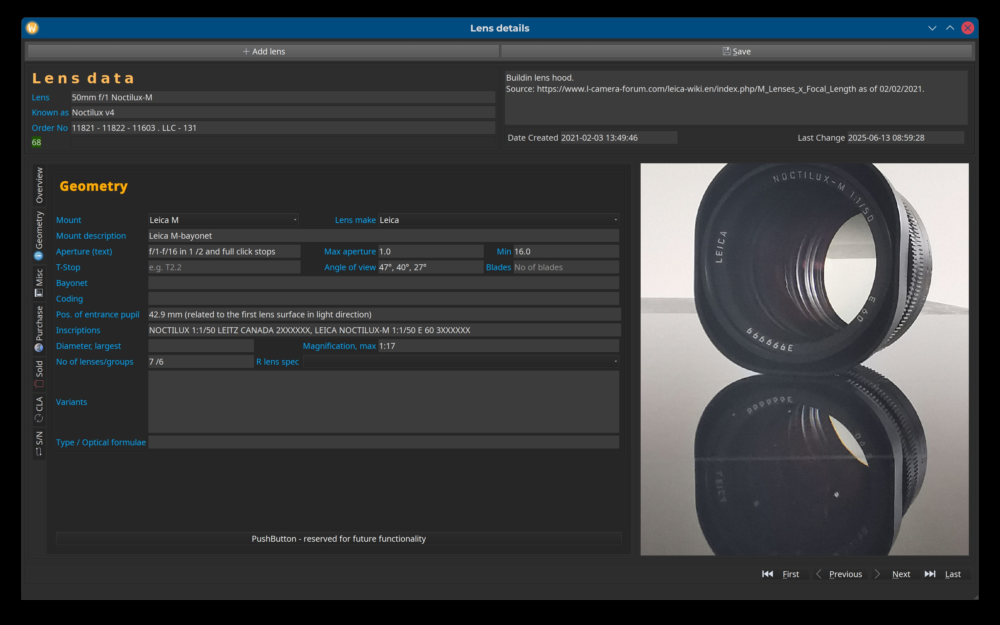

# Lens-Register
Managing lenses and their properties - manufacturers and mounts.
I recently started familiarising myself with Python. My aim was to rewrite a programme that I wrote in the distant past in a fairly unknown programming language using a more modern programming language. It should have a simple GUI and run locally (not a web app) and on all common operating systems. I decided in favour of Python 3.12 with PySide6 and the Qt framework. The data is all stored in a local database sqlite3. Custom lenses can be colour-coded and commented on. I reckon the need for such a programme is quite limited as it is not a web based application. You are cordially invited to contribute to this project. You can either help programme and optimize it or simply add further ideas and a few more use cases.
So simply start main.py and you'll get a list of all lenses in the local database.

Double-click the lens you want to see the details of.

All kinds and types of lenses can be entered. If a manufacturer is missing, this can be added.

There are heaps of mount types out there. If something is missing, this can be added either.

